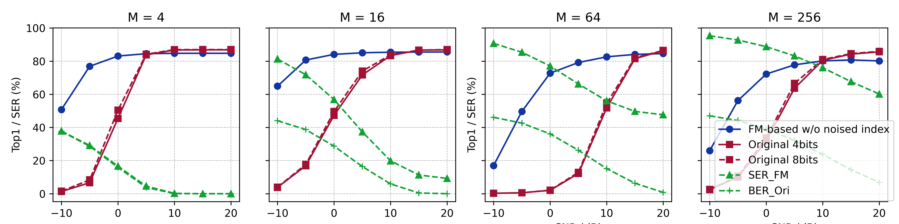

# FMSM: A Flow-Matching-Based Semantic Feature Modulation with Variable Order
## Introduction
This repository introduces a novel flow-matching-based semantic feature modulation method with variable order called FMSM.
## Architecture

## Prime Results
Verification in the ImageNet-1k with DINOv3.

